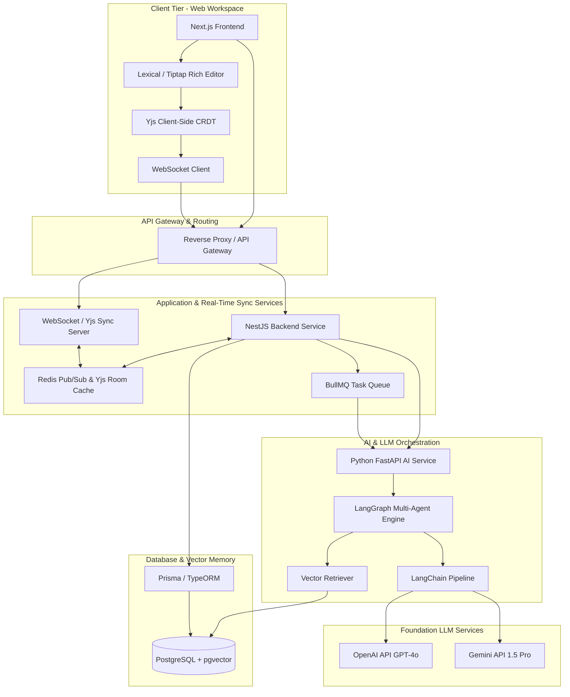
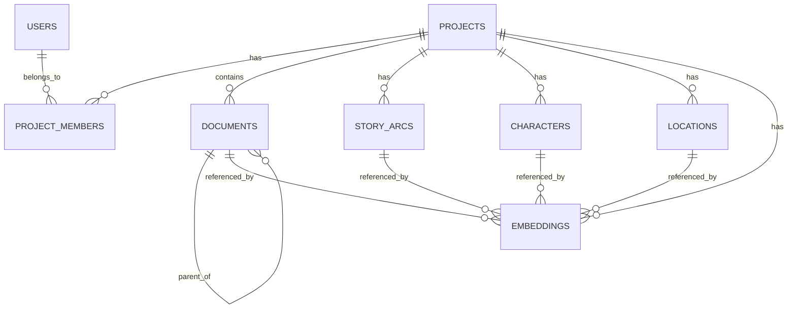
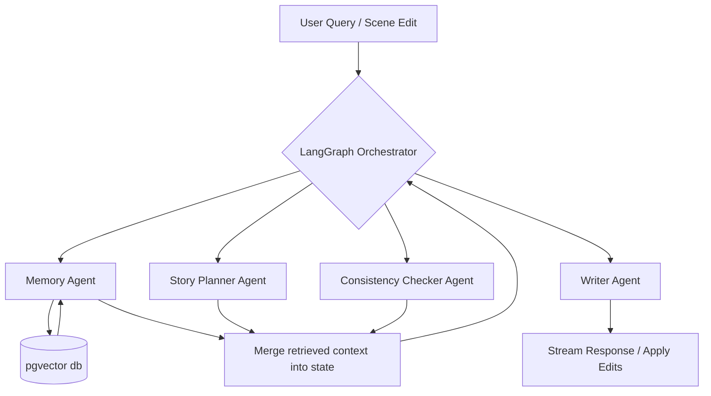
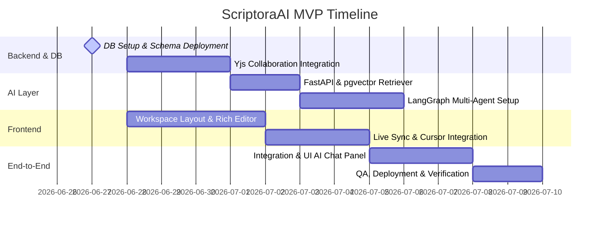

# ScriptoraAI: System Specification & Architecture Design

ScriptoraAI is a production-grade, collaborative, AI-powered narrative planning workspace for writers, content creators, and studios. It combines real-time document collaboration (CRDT-based), structured story hierarchies, persistent vector-based narrative memory, and a multi-agent AI orchestration engine.

---

## 1. System Architecture Diagram

ScriptoraAI uses a hybrid, modular microservices architecture designed to decouple real-time text editing, structured relational state, and intensive AI reasoning.

### High-Level System Architecture



### Data Flow Specifications

#### A. Real-Time Collaboration & Synchronization Loop
1. **User Edit**: A user types a letter in the Tiptap/Lexical editor.
2. **Local CRDT Update**: The editor captures changes and applies them to the local `Y.Doc`.
3. **WebSocket Transmission**: The change is serialized into a binary state update (`Uint8Array`) and broadcast via WebSockets.
4. **WebSocket Server Processing**: The `Yjs Sync Server` (NestJS WebSockets) receives the update, merges it, and broadcasts it to all other active collaborators in the same room.
5. **Persistence**: To avoid database bottlenecks, updates are debounced and cached in Redis. Every 2 seconds (or after inactivity), the merged document state is written asynchronously to PostgreSQL.

#### B. Narrative Memory Chunking & Embedding Pipeline
1. **Change Debounce**: Once editing stops for a document, NestJS triggers a background task via BullMQ.
2. **Chunking**: The FastAPI AI service retrieves the text, splits it into semantic chunks (using Markdown/Hierarchy-aware splitters), and generates embeddings (e.g., via `text-embedding-3-small`).
3. **Vector Upsert**: The chunks and their vector representations are stored in PostgreSQL using `pgvector` (`vector(1536)`), tagged with metadata (`project_id`, `document_id`, `entity_type`).

#### C. Multi-Agent AI Inference & Context Retrieval
1. **User Prompt**: A user requests a consistency check: *"Does John's action in this scene conflict with his profile or prior actions?"*
2. **FastAPI Request**: NestJS forwards the request to FastAPI.
3. **Graph Initialization**: LangGraph starts the workflow.
4. **Retrieval (Memory Agent)**: The Memory Agent issues a vector search (using cosine similarity on `pgvector`) to find relevant character profiles, locations, and historical scenes.
5. **Agent Collaboration**: The Consistency Checker Agent receives the retrieved context along with the current scene text. It collaborates with the Story Planner Agent to validate alignment.
6. **Response Generation**: The Writer Agent formats the final critique/suggestion, which is streamed back to the client via Server-Sent Events (SSE) or WebSockets.

---

## 2. Database Schema Design

The relational database uses **PostgreSQL 16+** with the **pgvector** extension. This allows seamless blending of highly structured relational queries (e.g., fetching document trees) and semantic similarity searches (e.g., searching for character inconsistencies).



### SQL DDL Specification

```sql
-- Enable necessary extensions
CREATE EXTENSION IF NOT EXISTS "uuid-ossp";
CREATE EXTENSION IF NOT EXISTS "vector";

-- Enum types
CREATE TYPE member_role AS ENUM ('CREATOR', 'CO_WRITER', 'EDITOR');
CREATE TYPE doc_type AS ENUM ('STORY', 'ACT', 'CHAPTER', 'SCENE');
CREATE TYPE entity_type AS ENUM ('DOCUMENT', 'CHARACTER', 'LOCATION', 'STORY_ARC');

-- Users Table
CREATE TABLE users (
    id UUID PRIMARY KEY DEFAULT uuid_generate_v4(),
    email VARCHAR(255) UNIQUE NOT NULL,
    password_hash VARCHAR(255) NOT NULL,
    display_name VARCHAR(100) NOT NULL,
    avatar_url TEXT,
    created_at TIMESTAMP WITH TIME ZONE DEFAULT CURRENT_TIMESTAMP,
    updated_at TIMESTAMP WITH TIME ZONE DEFAULT CURRENT_TIMESTAMP
);

-- Projects Table
CREATE TABLE projects (
    id UUID PRIMARY KEY DEFAULT uuid_generate_v4(),
    name VARCHAR(255) NOT NULL,
    description TEXT,
    owner_id UUID NOT NULL REFERENCES users(id) ON DELETE CASCADE,
    created_at TIMESTAMP WITH TIME ZONE DEFAULT CURRENT_TIMESTAMP,
    updated_at TIMESTAMP WITH TIME ZONE DEFAULT CURRENT_TIMESTAMP
);

-- Project Members Table (RBAC)
CREATE TABLE project_members (
    id UUID PRIMARY KEY DEFAULT uuid_generate_v4(),
    project_id UUID NOT NULL REFERENCES projects(id) ON DELETE CASCADE,
    user_id UUID NOT NULL REFERENCES users(id) ON DELETE CASCADE,
    role member_role NOT NULL DEFAULT 'EDITOR',
    created_at TIMESTAMP WITH TIME ZONE DEFAULT CURRENT_TIMESTAMP,
    UNIQUE(project_id, user_id)
);

-- Documents Table (Hierarchical Structure)
CREATE TABLE documents (
    id UUID PRIMARY KEY DEFAULT uuid_generate_v4(),
    project_id UUID NOT NULL REFERENCES projects(id) ON DELETE CASCADE,
    parent_id UUID REFERENCES documents(id) ON DELETE SET NULL,
    title VARCHAR(255) NOT NULL,
    type doc_type NOT NULL DEFAULT 'SCENE',
    position INT NOT NULL DEFAULT 0, -- Order sibling documents
    content_yjs BYTEA, -- Store serialized Yjs state updates
    content_text TEXT, -- Stored flat text representation for search/indexing
    created_at TIMESTAMP WITH TIME ZONE DEFAULT CURRENT_TIMESTAMP,
    updated_at TIMESTAMP WITH TIME ZONE DEFAULT CURRENT_TIMESTAMP
);

-- Story Arcs Table
CREATE TABLE story_arcs (
    id UUID PRIMARY KEY DEFAULT uuid_generate_v4(),
    project_id UUID NOT NULL REFERENCES projects(id) ON DELETE CASCADE,
    name VARCHAR(255) NOT NULL,
    description TEXT,
    status VARCHAR(50) DEFAULT 'PLANNING', -- e.g., Planning, In Progress, Completed
    created_at TIMESTAMP WITH TIME ZONE DEFAULT CURRENT_TIMESTAMP,
    updated_at TIMESTAMP WITH TIME ZONE DEFAULT CURRENT_TIMESTAMP
);

-- Characters Table
CREATE TABLE characters (
    id UUID PRIMARY KEY DEFAULT uuid_generate_v4(),
    project_id UUID NOT NULL REFERENCES projects(id) ON DELETE CASCADE,
    name VARCHAR(255) NOT NULL,
    archetype VARCHAR(100),
    description TEXT,
    attributes JSONB, -- Custom characteristics (e.g., age, physical details, motivation)
    avatar_url TEXT,
    created_at TIMESTAMP WITH TIME ZONE DEFAULT CURRENT_TIMESTAMP,
    updated_at TIMESTAMP WITH TIME ZONE DEFAULT CURRENT_TIMESTAMP
);

-- Locations Table
CREATE TABLE locations (
    id UUID PRIMARY KEY DEFAULT uuid_generate_v4(),
    project_id UUID NOT NULL REFERENCES projects(id) ON DELETE CASCADE,
    name VARCHAR(255) NOT NULL,
    description TEXT,
    details JSONB, -- Extra geographical or historical details
    created_at TIMESTAMP WITH TIME ZONE DEFAULT CURRENT_TIMESTAMP,
    updated_at TIMESTAMP WITH TIME ZONE DEFAULT CURRENT_TIMESTAMP
);

-- Vector Embeddings Table (Persistent Narrative Memory)
CREATE TABLE narrative_embeddings (
    id UUID PRIMARY KEY DEFAULT uuid_generate_v4(),
    project_id UUID NOT NULL REFERENCES projects(id) ON DELETE CASCADE,
    entity_id UUID NOT NULL, -- References document_id, character_id, location_id, or arc_id
    type entity_type NOT NULL,
    chunk_content TEXT NOT NULL,
    embedding vector(1536) NOT NULL, -- Dimension match for openai/gemini embeddings
    metadata JSONB DEFAULT '{}', -- Store details like section, scene index, token count
    created_at TIMESTAMP WITH TIME ZONE DEFAULT CURRENT_TIMESTAMP
);

-- Indices for performance tuning
CREATE INDEX idx_documents_project_parent ON documents(project_id, parent_id);
CREATE INDEX idx_project_members_user ON project_members(user_id);
CREATE INDEX idx_narrative_embeddings_project ON narrative_embeddings(project_id);
CREATE INDEX idx_narrative_embeddings_type ON narrative_embeddings(type);

-- pgvector HNSW Index for fast similarity searching
CREATE INDEX idx_narrative_embeddings_vector ON narrative_embeddings USING hnsw (embedding vector_cosine_ops);
```

---

## 3. Project Folder Structure

```
scriptora-workspace/
├── apps/
│   ├── frontend/                 # Next.js Application
│   │   ├── src/
│   │   │   ├── assets/           # Global styles and static assets
│   │   │   ├── components/       # Shared UI components (Sidebar, Chat Panel)
│   │   │   │   ├── editor/       # Lexical/Tiptap collab editor components
│   │   │   │   └── ui/           # Design System Atoms (Buttons, Modal, Inputs)
│   │   │   ├── hooks/            # Custom React hooks (useCollab, useWebSocket)
│   │   │   ├── layouts/          # Page layouts (Dashboard, Distraction-Free Writer)
│   │   │   ├── pages/            # Next.js Page router or app directory
│   │   │   ├── services/         # Client-side API connections (Axios/SWR/React Query)
│   │   │   ├── store/            # State management (Zustand/Redux Toolkit)
│   │   │   └── types/            # TypeScript type declarations
│   │   ├── tailwind.config.js
│   │   └── tsconfig.json
│   │
│   ├── backend/                  # NestJS Application
│   │   ├── src/
│   │   │   ├── auth/             # JWT, RBAC Guard modules
│   │   │   ├── projects/         # Projects CRUD module
│   │   │   ├── documents/        # Hierarchical documents and Yjs state persistence
│   │   │   ├── collab/           # Yjs WebSocket Gateway & Room management
│   │   │   ├── shared/           # Database module (Prisma client, Redis config)
│   │   │   ├── queue/            # BullMQ worker and publisher setup
│   │   │   └── main.ts           # App bootstrap
│   │   ├── prisma/               # Schema configuration and database migrations
│   │   └── package.json
│   │
│   └── ai-service/               # Python FastAPI AI Service
│       ├── app/
│       │   ├── agents/           # Multi-agent specifications
│       │   │   ├── planner.py    # Story Planner Agent logic
│       │   │   ├── writer.py     # Writer Agent logic
│       │   │   ├── memory.py     # Memory Agent logic
│       │   │   └── checker.py    # Consistency Checker Agent logic
│       │   ├── core/             # Configuration, logger, security
│       │   ├── database/         # Pgvector direct connection/retriever
│       │   ├── graph/            # LangGraph compilation & workflow state definition
│       │   ├── schemas/          # Pydantic request/response structures
│       │   └── main.py           # FastAPI entrypoint
│       ├── Dockerfile
│       └── requirements.txt
│
├── packages/
│   └── shared-types/             # Shared TypeScript definitions (DTOS, WS messages)
│       └── index.ts
│
├── package.json                  # Turborepo / pnpm workspace root
└── turbo.json
```

---

## 4. AI Agent Design Specification

ScriptoraAI orchestrates four specialized agents to assist the writer. They communicate through **LangGraph** using a shared state object containing the document tree, current context, user query, and diagnostic logs.



### Agent State Schema (LangGraph)
```python
class AgentState(TypedDict):
    project_id: str
    current_document_id: str
    document_content: str
    retrieved_memory: List[dict]
    story_beats: List[str]
    inconsistencies: List[dict]
    messages: List[BaseMessage]
```

---

### Agent Specifications

#### 1. Memory Agent
*   **Role Definition**: Acts as the cognitive retrieval engine. Converts user text, scene details, character descriptors, and story arcs into chunks, registers embeddings, and retrieves relevant contextual narrative threads.
*   **Vector Search & Retrieve Strategy**:
    *   Uses metadata filtering on `project_id`.
    *   Extracts entity tokens (names of characters/locations) from the current scene to perform hybrid semantic/keyword search.
*   **System Prompt**:
```markdown
You are the Memory Agent for ScriptoraAI. Your primary responsibility is maintaining narrative continuity.
Your function is to ingest narrative updates, generate structured metadata tags, and query the vector store for contextually matching details.
When query requests are sent to you, always return:
1. Exact descriptions, traits, and background stories of characters mentioned in the active context.
2. Chronological events and settings related to the active scene.
3. Details of story arcs currently active in this project.
Do not invent facts. Return only retrieved vectors and matching SQL data.
```

---

#### 2. Story Planner Agent
*   **Role Definition**: Assists the user in planning plot outlines, act structures (e.g., Three-Act Structure, Hero's Journey), scene sequences, and narrative pacing.
*   **System Prompt**:
```markdown
You are the Story Planner Agent, a master dramaturg and narrative designer.
Your role is to help the writer structure their narrative outline, develop character arcs, and suggest pacing improvements.
You analyze story beats and outline hierarchies to ensure dramatic tension remains balanced.
When responding:
- Adhere strictly to the requested framework (e.g., Three-Act Structure, Save the Cat!, Dan Harmon's Story Circle).
- Break suggestions down into actionable structural beats (Inciting Incident, Midpoint, Climax, etc.).
- Ensure your suggestions build logically on the retrieved narrative context provided by the Memory Agent.
```

---

#### 3. Writer Agent
*   **Role Definition**: Drafts scene text, expands outlines, refines dialogue, and adapts to the specific authorial tone.
*   **System Prompt**:
```markdown
You are the Writer Agent, a highly skilled creative writer, dialogue editor, and prose stylist.
Your task is to convert story beats into vivid, engaging narrative scenes or refine user-submitted text.
You must:
- Match the user's established tone, style, pacing, and vocabulary (derived from the retrieved context).
- Focus on showing rather than telling.
- Write dialogue that is natural, character-appropriate, and avoids exposition dumps.
- Strictly adhere to character traits and constraints retrieved by the Memory Agent (e.g., a character who speaks with a dialect must maintain that dialect).
```

---

#### 4. Consistency Checker Agent
*   **Role Definition**: Scans newly written text against the persistent database state, checking for plot holes, continuity errors, physical contradictions, and character behavior deviations.
*   **System Prompt**:
```markdown
You are the Consistency Checker Agent, a precise narrative continuity supervisor.
Your job is to read user drafts and identify discrepancies between the draft and established narrative facts.
Evaluate the following categories for potential contradictions:
1. Physicality & Geography: (e.g., character was in London, but now suddenly in New York within 5 minutes).
2. Lore & History: (e.g., character is allergic to nuts but eats peanut butter).
3. Personality & Tone: (e.g., a highly introverted character suddenly delivering an extroverted public speech without explanation).
Format all outputs as a JSON array of issues:
[
  {
    "severity": "CRITICAL" | "WARNING" | "INFO",
    "issue_description": "Explanation of inconsistency...",
    "source_reference": "Name of character/document causing conflict",
    "suggested_fix": "How to resolve the contradiction"
  }
]
```

---

## 5. API Design (Endpoint Specifications)

All REST routes require a valid JWT token in the `Authorization: Bearer <JWT>` header. Real-time collaboration operates via WebSocket protocols.

### REST Endpoints

#### Projects Module
*   `POST /api/v1/projects`
    *   **Description**: Creates a new workspace project.
    *   **Request Body**:
        ```json
        {
          "name": "The Obsidian Spire",
          "description": "An epic dark fantasy novel."
        }
        ```
    *   **Response (201 Created)**:
        ```json
        {
          "id": "e0a0d6b6-8a0a-4fb4-9c02-7c6dcf0bfa20",
          "name": "The Obsidian Spire",
          "owner_id": "87f2e1a3-2bf9-450f-a9cb-4c8dcf0be111",
          "created_at": "2026-06-25T18:00:00Z"
        }
        ```

*   `GET /api/v1/projects/:id`
    *   **Description**: Retrieves project metadata along with member access levels.

---

#### Documents Module
*   `POST /api/v1/projects/:projectId/documents`
    *   **Description**: Adds a document (Story, Act, Chapter, or Scene) into the hierarchical workspace.
    *   **Request Body**:
        ```json
        {
          "title": "Scene 1: The Dark Gate",
          "type": "SCENE",
          "parent_id": "ff2c3d4e-1a2b-3c4d-5e6f-7a8b9c0d1e2f",
          "position": 3
        }
        ```
    *   **Response (201 Created)**:
        ```json
        {
          "id": "d1a2b3c4-e5f6-7a8b-9c0d-1e2f3a4b5c6d",
          "title": "Scene 1: The Dark Gate",
          "type": "SCENE",
          "parent_id": "ff2c3d4e-1a2b-3c4d-5e6f-7a8b9c0d1e2f",
          "position": 3,
          "project_id": "e0a0d6b6-8a0a-4fb4-9c02-7c6dcf0bfa20"
        }
        ```

*   `PATCH /api/v1/projects/:projectId/documents/:id/move`
    *   **Description**: Re-parents or re-orders a document in the project hierarchy tree.
    *   **Request Body**:
        ```json
        {
          "parent_id": "c1a2b3c4-e5f6-7a8b-9c0d-1e2f3a4b5c6e",
          "position": 1
        }
        ```
    *   **Response (200 OK)**:
        ```json
        {
          "id": "d1a2b3c4-e5f6-7a8b-9c0d-1e2f3a4b5c6d",
          "parent_id": "c1a2b3c4-e5f6-7a8b-9c0d-1e2f3a4b5c6e",
          "position": 1
        }
        ```

---

#### AI Agent Interaction Module (Python FastAPI / NestJS proxy)
*   `POST /api/v1/ai/:projectId/generate`
    *   **Description**: Triggers the Writer Agent to expand or generate prose.
    *   **Request Body**:
        ```json
        {
          "document_id": "d1a2b3c4-e5f6-7a8b-9c0d-1e2f3a4b5c6d",
          "prompt": "Write a suspenseful scene where John opens the vault.",
          "tone_reference_doc_id": "c3d4e5f6-7a8b-9c0d-1e2f-3a4b5c6d7e8f"
        }
        ```
    *   **Response (200 OK - Streamed Server-Sent Events)**:
        `data: {"text": "John's fingers trembled as..."}`

*   `POST /api/v1/ai/:projectId/plan-story`
    *   **Description**: Requests structural story suggestions or beat progression options.
    *   **Request Body**:
        ```json
        {
          "current_beats": ["John enters cave", "John finds relic"],
          "framework": "HEROS_JOURNEY",
          "target_step": "CROSSING_THRESHOLD"
        }
        ```

*   `POST /api/v1/ai/:projectId/check-consistency`
    *   **Description**: Validates the selected document text against database profiles.
    *   **Request Body**:
        ```json
        {
          "document_id": "d1a2b3c4-e5f6-7a8b-9c0d-1e2f3a4b5c6d",
          "draft_text": "John runs down the hall, leaping over the rubble with both legs."
        }
        ```
    *   **Response (200 OK)**:
        ```json
        {
          "consistent": false,
          "inconsistencies": [
            {
              "severity": "CRITICAL",
              "issue_description": "John was established to have a broken left leg in 'Chapter 2: The Fall'. Running and leaping contradicts this.",
              "source_reference": "Chapter 2: The Fall (Document ID: cc21e1a3-2bf9-450f-a9cb-4c8dcf0be456)",
              "suggested_fix": "Describe John limping or relying heavily on support, or alter his injury timeline."
            }
          ]
        }
        ```

---

#### Narrative Memory Search
*   `GET /api/v1/projects/:projectId/memory/search`
    *   **Description**: Searches the pgvector database semantic store for narrative entities.
    *   **Query Params**: `query=golden key&type=CHARACTER`
    *   **Response (200 OK)**:
        ```json
        [
          {
            "entity_id": "b3c4d5e6-7a8b-9c0d-1e2f-3a4b5c6d7e8f",
            "type": "CHARACTER",
            "content": "Aria carries the golden key. It was passed down from her grandmother.",
            "similarity": 0.892
          }
        ]
        ```

---

### WebSocket Collaboration Protocol (`/collaboration/sync`)

Clients connect via Socket.io or standard WebSockets.

#### WS Event flows:
1.  **Join Room**: `client -> server: { "event": "join-room", "data": { "projectId": "...", "documentId": "..." } }`
2.  **Acknowledge & Send Init State**: `server -> client: { "event": "init-state", "data": { "yjsState": "Uint8Array" } }`
3.  **Sync Update**: `client -> server: { "event": "sync-update", "data": { "update": "Uint8Array" } }`
4.  **Cursor Position**: `client -> server: { "event": "cursor-move", "data": { "userId": "...", "cursor": { "anchor": 12, "head": 15 } } }`
5.  **Broadcast Cursor**: `server -> client: { "event": "cursor-update", "data": { "userId": "...", "cursor": { "anchor": 12, "head": 15 } } }`

---

## 6. 7–14 Day MVP Build Plan

This plan is focused on launching a functional collaborative editor containing Vector-based memory retrieval and fundamental AI agency.



### Day-by-Day Milestone Specification

#### Milestone 1: Core Setup & Data Layer (Days 1–3)
*   **Goal**: Establish the running PostgreSQL database with pgvector, design the Prisma schema, set up Next.js UI structure, and configure basic REST endpoints.
*   **Execution Tasks**:
    *   Initialize turborepo workspace.
    *   Configure PostgreSQL + pgvector locally or on Supabase.
    *   Deploy DDL tables (Users, Projects, Members, Documents).
    *   Build base layout in Next.js (Sidebar list navigation, core theme styling).
*   **Estimated Effort**: 3 Days.
*   **Risk**: Database configuration changes across platforms. *Mitigation*: Use containerized Docker compose files for local development.

#### Milestone 2: Collaborative Rich-Text Editing (Days 4–6)
*   **Goal**: Implement real-time multi-user syncing via Yjs inside a Lexical or Tiptap editor.
*   **Execution Tasks**:
    *   Integrate Tiptap client with Yjs inside Next.js.
    *   Set up NestJS WebSocket Gateway handling client synchronization binaries (`Uint8Array`).
    *   Implement Redis document caching and debounced database writers to persist document states.
    *   Implement user awareness cursors on the frontend.
*   **Estimated Effort**: 3 Days.
*   **Risk**: Synchronizing binary updates over unstable networks. *Mitigation*: Strict version-control checks inside WebSocket handshakes.

#### Milestone 3: Vector Memory Engine & FastAPI (Days 7–8)
*   **Goal**: Spin up Python FastAPI service, connect to PostgreSQL, and handle automatic semantic embedding compilation.
*   **Execution Tasks**:
    *   Create FastAPI service; connect it to the same PostgreSQL database.
    *   Configure LangChain / LlamaIndex semantic retrieval agents.
    *   Create BullMQ worker in NestJS that forwards document text changes to FastAPI whenever a writer pauses typing.
    *   Verify pgvector similarity query speeds.
*   **Estimated Effort**: 2 Days.
*   **Risk**: High latency during vector upsert loops. *Mitigation*: Offload text splitting and embedding generation entirely to background workers.

#### Milestone 4: Multi-Agent AI Orchestration (Days 9–11)
*   **Goal**: Combine Memory Agent, Consistency Checker, and Writer Agent outputs using LangGraph.
*   **Execution Tasks**:
    *   Write LangGraph graph definition routing user intents (Write vs Check Continuity).
    *   Embed agent system prompts inside LangGraph execution state.
    *   Build REST/WebSocket hooks enabling Next.js frontend to send generation prompts.
*   **Estimated Effort**: 3 Days.
*   **Risk**: LLM hallucination and state loop lockups. *Mitigation*: Cap loop iterations inside LangGraph config.

#### Milestone 5: Front-to-Back Integration & Polish (Days 12–14)
*   **Goal**: Implement the distraction-free workspace aesthetics, polish UI transitions, deploy, and verify.
*   **Execution Tasks**:
    *   Build the AI chat sidebar panel, showing active contradictions or character sheets.
    *   Implement SSE (Server-Sent Events) to stream agent responses word-by-word.
    *   Deploy frontend (Vercel), backend (Railway), and DB (Supabase).
    *   Run end-to-end user checks (simultaneous writing + real-time consistency highlighting).
*   **Estimated Effort**: 3 Days.
*   **Risk**: Deploy configuration variables mismatch. *Mitigation*: Maintain strict dotenv templates.

---

## 7. Scaling & Optimization Recommendations

To support production-level usage featuring thousands of concurrent writing sessions and continuous real-time AI checking, the following architectural scaling optimizations should be applied:

### A. Real-Time CRDT State Sync Optimization
*   **Yjs Document Splitting**: Large books or scripts (e.g., 100,000+ words) create massive Yjs update histories, causing client lagging.
    *   *Solution*: Never sync a whole book as a single `Y.Doc`. Treat every **Scene** or **Chapter** as a distinct `Y.Doc` room. The frontend dynamic-loads rooms as the user scrolls, minimizing memory usage.
*   **WebSocket Clustering with Redis**: As connection counts grow beyond a single backend server instance, WebSockets must share states.
    *   *Solution*: Deploy a Redis Pub/Sub backplane (`y-redis` adapter) to distribute Yjs binary changes across NestJS nodes.

### B. Vector Database Tuning (`pgvector` + `HNSW`)
*   **Embedding Partitioning**: Storing thousands of user books in a single flat vector table ruins query times.
    *   *Solution*: Apply PostgreSQL Row-Level Security (RLS) or partition tables by `project_id`. Create composite indexes linking metadata so queries filter by project *before* searching vector similarity space.
*   **HNSW Parameter Tuning**:
    *   Set `m` (maximum connections per node) to `16` and `ef_construction` (size of dynamic candidate list for index building) to `64` during early stages. As the narrative database exceeds millions of chunks, increase to `m = 24`, `ef_construction = 128` to maintain recall accuracy above 95%.

### C. Agent Orchestration & LLM Cost Optimization
*   **Prompt Caching**: Agents often request the same background lore or character profiles.
    *   *Solution*: Utilize OpenAI/Gemini prompt caching for static project backgrounds. Cache characters and location briefs inside Redis for up to 30 minutes, avoiding repetitive LLM extraction steps.
*   **Stateful Asynchronous Queues**: LangGraph states can be slow.
    *   *Solution*: Set up asynchronous execution. Instead of blocking the HTTP thread during consistency checks, write requests to BullMQ, stream progressive steps to the client via WebSockets, and persist results to the SQL database.
